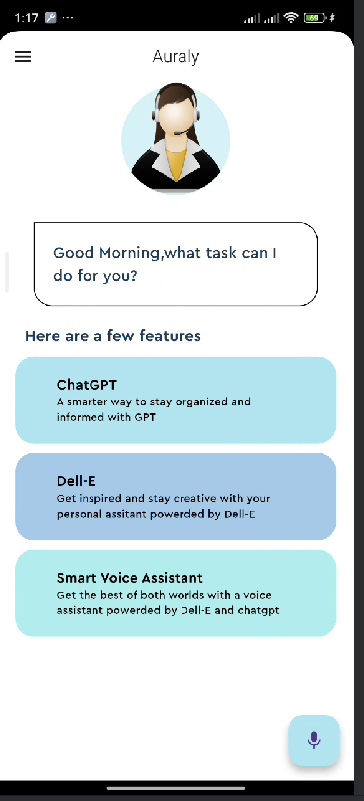

# Auraly - Voice Assistant App

Auraly is a Flutter-based voice assistant app that listens to your voice commands and responds intelligently with text or images.  
It is designed to integrate with OpenAI APIs (ChatGPT for text and DALL-E for images) and provides a smooth, animated UI experience.  

**Note:** The app may not show live ChatGPT or DALL-E responses if your OpenAI account has exceeded free trial credits or does not have an active API plan. In this case, the app displays placeholder responses.

---
## Features

- Voice recognition using [`speech_to_text`]
- Text-to-Speech using [`flutter_tts`]
- Intelligent responses powered by ChatGPT (text)
- Image generation powered by DALL-E (image URLs)
- Animated UI components using [`animate_do`]
---
## UI Preview

Here is the home screen UI of the app:

> ⚠️ Note: Live ChatGPT/DALL-E responses are not shown due to API quota limitations, but the UI and voice features work as expected.

## How to Run
Add your API key in `lib/sample.dart` and run `flutter run`

