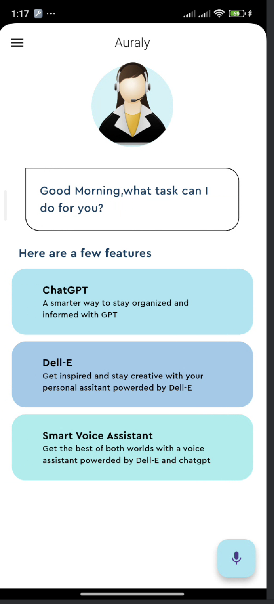

# Auraly - Voice Assistant App

Auraly is a Flutter-based voice assistant app that listens to your voice (or takes typed input) and responds intelligently, powered by Google Gemini.

---
## Features

- Voice recognition using [`speech_to_text`], with a typed-message fallback
- Text-to-Speech using [`flutter_tts`], with adjustable rate, pitch, and voice
- Streamed, markdown-rendered responses powered by Google Gemini
- Persisted conversation history, dark mode, and multi-language support
- Your own Gemini API key, stored encrypted on-device - never bundled in the app
- Animated UI components using [`animate_do`]

---
## UI Preview

Here is the home screen UI of the app:

## How to Run

1. Run `flutter pub get`.
2. Run `flutter run`.
3. On first launch, grant microphone access, then get a free API key at https://aistudio.google.com/apikey and paste it into the sign-in screen. It's stored encrypted on your device only, and can be changed later from Settings.
